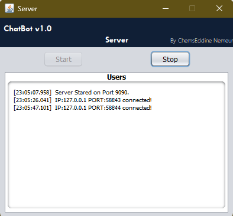
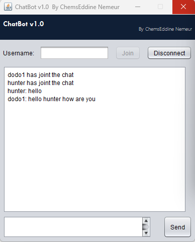
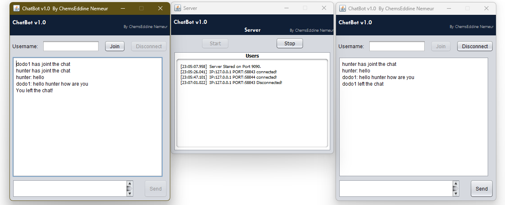

# ChatBot v1.0 - Instant Messaging System

A Java-based **Instant Messaging** application (Group Chat) designed for Windows users on a Local Host network. This project was developed as part of a multi-disciplinary module at the University of Bejaia.

---

## 🖼️ Screenshots
| Image 1: Server Control | Image 2: Client Interface | Image 3: Group Discussion |
| :---: | :---: | :---: |
|  |  |  |

---

## ⚙️ Features
* **Multi-Client Support**: The server handles up to **10 simultaneous connections** using a `handleclient` class.
* **Real-time Broadcasting**: Uses a `BroadcastToall` method to relay messages instantly to all active participants.
* **Connection Monitoring**: The server monitors and displays all connection/disconnection events in real-time on Port 9090.
* **Duplicate Prevention**: Rejects new connections if the username is already in use by another active client.
* **Volatile Messaging**: For privacy and speed, the application **does not use a database**; messages are not stored, and user lists reset every session.

---

## 📂 Project Structure
The repository is organized into executable binaries and modular source code:

* **📂 Executable**: Contains pre-built `Client.jar` and `Server.jar` for immediate testing.
* **📂 Source code**: 
    * **Client**: Java source files and NetBeans project metadata for the user interface.
    * **Server**: Java source files and logic for managing socket connections.

---

## 🛠️ Technical Specifications
* **Language**: Java 8 (Update 261 build 12).
* **IDE**: Netbeans 11.3.
* **Network**: Local Host (Port 9090).
* **OS**: Windows.

---

## 🏃 How to Run
1. **Start the Server**: Open the `Server` folder, run the application, and click the **Start** button.
2. **Launch Clients**: Run the `Client` application.
3. **Join Chat**: Enter a username (**3 to 10 characters**) and click **Join**.
4. **Communicate**: Send messages using the **Send** button or by pressing the **Enter** key.